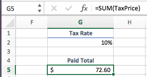
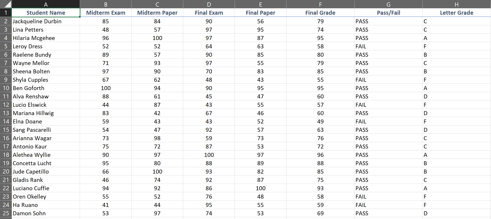
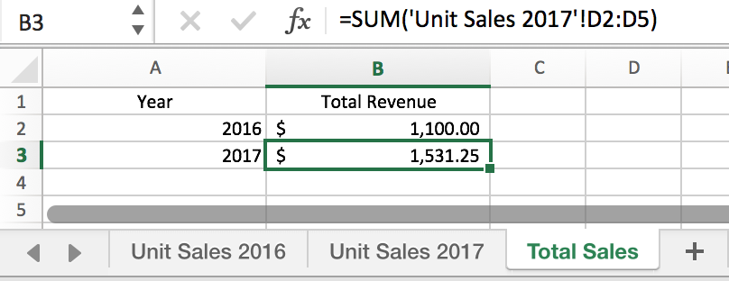
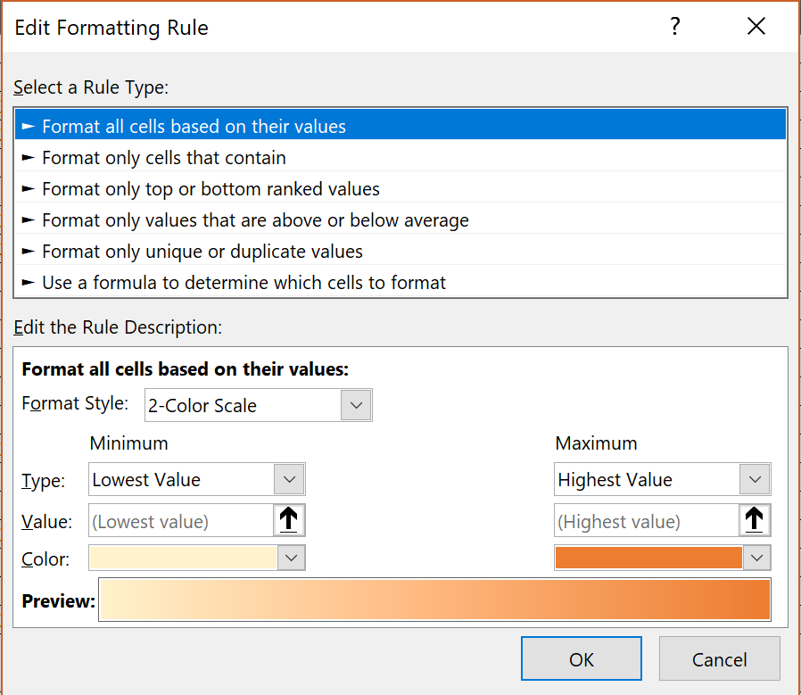

## 1.2 Lesson Plan - Egad It's Excel!

### Overview

In this class, students will be introduced to more advanced features in Microsoft Excel such as Pivot Tables, Lookups, and Conditional Formatting.

### Class Objectives

* Students will feel fully proficient in basic Excel navigation and functionality
* Students will gain familiarity with the value of Pivot Tables and the steps for their utilization.
* Students will gain comfort utilizing VLookups and HLookups
* Students will understand how to implement conditional formatting based on logical rules

### Instructor Notes

* Welcome back to Day 2! Hope your first day was fun. Today's session marks the first "real" class. As will be the case throughout this program, you will be guiding students through a series of exercises of increasing complexity.

* Today's class is wholly focused on Microsoft Excel. Admittedly, Microsoft Excel isn't the most invigorating of subjects to teach. However, it is of critical importance that, as future analysts, your students gain strong mastery of the tools less commonly used by everyday users. You'd be surprised by the number of your students who will struggle with creating advanced conditionals even in Microsoft Excel.

* Spend time prior to class practicing your work-flow. Opening and navigating through multiple spreadsheets can easily feel cumbersome. Make sure that you are well aware of the layout and key takeaways for all activities prior to class. There's a "magic" felt in a class where things flow seamlessly, but this magic requires active preparation from you to create.

* As you talk through today's exercises find ways to pepper in commentary around the benefits and limitations of Microsoft Excel vs. the future topics we'll be introducing. Excel has its uses, but so too will Python, JavaScript, and SQL.

* Have your TAs refer to the [Time Tracker](TimeTracker.xlsx) to stay on track.

* Please reference our [Student FAQ](../../../05-Instructor-Resources/README.md#unit-01-excel) for answers to questions frequently asked by students of this program. If you have any recommendations for additional questions, feel free to log an issue or a pull request with your desired additions.

* Remember to update today's slideshow to include information relevant to your own class. Specifically, there are two slides that require you to insert links to your class's GitHub repository and Panopto Video Feed.

* Lastly, as a reminder these slideshows are for instructor use only - when distributing slides to students, please first export the slides to a PDF file. You may then distribute the PDF file through Slack.

### Sample Class Video

* To view an example class lecture visit (Note video may not reflect latest lesson plan): [1.2 Class Video](https://codingbootcamp.hosted.panopto.com/Panopto/Pages/Viewer.aspx?id=cf092e8b-df9e-4c85-ae59-3483f8cbcd1c)

- - -

### 1. Instructor Do: Egad! It's Excel Slideshow (0:05)

* Open the [slideshow](https://drive.google.com/open?id=1mST2NbkvWet_eAN2NM7KH13PFZVeWud-4mqTgTXTRWw) for today's class. Take note that you will _not_ be presenting these slides all at once. Rather, you will be using the slides to preface key activity sections. Use the "Demo Time" slide breaks as your cue to introduce activities.

* Complete the first series of slides, beginning with the "refresher". Actively call on students to answer the questions before showing the students the answers.

* Next, we will proceed to the section on Excel formulas. In this section, the students will be introduced to the syntax of formula building in Excel. Use this opportunity as a time to preview their future programming work with arguments, functions, and methods. As you will see over the next week, a core benefit of teaching Excel and VBA is that both provide a visual introduction to fundamental programming concepts.

### 2. Everyone Do: Update Excel (0:05)

* Once you are finished with the slides, the students will check for quick Excel Update. This is more important for Mac users, as a number of key analytics features have been recently ported to the Mac version of Excel.

* While students' software is updating, proceed to your first demo.

### 3. Instructor Do: Excel Playground (0:05)

* In this first demonstration, open the starter file inside [/01-Ins_ExcelPlayground/Solved/Excel_Playground_Starter.xlsx](Activities/01-Ins_ExcelPlayground/Solved/Excel_Playground_Starter.xlsx). The file includes a mock Grade Book.

* Acknowledge that the next demo will be simple before showing them how to manipulate the data in basic ways. Specifically,

  * Show the students how to calculate the average grade for each student by using the `average` function.

  * Show the students how to copy a formula downstream in an Excel column (using both copy/paste and by dragging the bottom right corner cell).

  

  * Finally, show the student how you can pull up the Excel Formula Builder to see a GUI for accessing Excel's off-the-shelf formulas. Use the appropriate formula to calculate the cells associated with average, max, min, and standard deviation of grades.

  

* Once complete, TAs should send your completed file for students.

### 4. Instructor Do: Named Ranges (0:05)

* Next, proceed to the example on [02-Ins_NamedRanges/ShoppingTrip.xlsx](Activities/02-Ins_NamedRanges/Solved/ShoppingTrip.xlsx).

  * Open the exercise and begin to highlight entire columns of existing data (e.g. `A1:A6`, `B1:B6`, etc.). Note the fact that the upper left corner indicates a named range. These can be created by selecting any set of cells and clicking to insert a name.

  

  * Show students that these named ranges can be used in formulas as any Excel selection typically would. Point out that named ranges provide a more readable version of spreadsheet formulas.

  

* Once complete, TAs should send out the spreadsheet for students to reference.

### 5. Instructor Do: Color Counter (0:05)

* Now, return to the slideshow, and introduce the concept of conditionals.

  * Talk about how conditionals are used to control the flow of logic. In Microsoft Excel, we use conditionals to selectively assign cell values.

  * Use the slides to talk through the concept of combining logical conditions using `AND`, `NOT`, and `OR`.

  * Feel encouraged to mention that these concepts of logical conditions are found across all programming languages.

* Then transition into the first demonstration on [03-Ins_ColorCounter/FavoriteColors.xlsx](Activities/03-Ins_ColorCounter/Solved/FavoriteColors.xlsx). Explain to students:

  * In this example, a column of colors is listed.

  * A row of color counters uses conditional statements like `COUNTIF(Colors, "Red")` to count the number of instances of each color.

  * A second row of "Above Five" counters use a _different_ version of conditional statement (`IF(C2>5), "TRUE", "FALSE"`) to check if the color count exceeds five for each color.

  * Remind students that in both cases, the cell value is determined by the above conditional.

* Answer any questions, then proceed to send it to students.

### 6. Partners Do: Review Color Counter (0:01)

* The students will reflect on the exercise for a moment or two with the person next to them. Once time is up, the students will re-explain the concept and syntax of conditionals in Excel.

### 7. Students Do: Gradebook (0:15)

* Next proceed with the first student exercise of the day. In this example, students are tasked with modifying a more complex grade book to determine the letter grades and pass/fail status of a make-believe class.

* Show students the solution, [04-Stu_GradeBook/GradeBook_Solved.xlsx](Activities/04-Stu_GradeBook/Solved/GradeBook_Solved.xlsx), they will be building to.

  * **File:**

    * [04-Stu_GradeBook/GradeBook_Unsolved.xlsx](Activities/04-Stu_GradeBook/Unsolved/GradeBook_Unsolved.xlsx)

  * **Instructions:**

    * Create a formula which calculates the final grade for a student based upon their previous exams and papers.

    * When making this calculation, every paper and exam should be

      * Considered equal in weight

      * Each one comprising one-fourth of a student's overall grade

      * Round the result to the nearest integer

    * Using conditionals, create a formula that returns `PASS` if a student's final grade is greater than or equal to 60. If the student's final grade is below 60, the formula should return `FAIL`.

  * **Bonus:**

    * Create a nested `IF()` formula which returns a letter grade based on a student's final grade.

      * Greater than or equal to 90 = `A`
      * Greater than or equal to 80 and less than 90 = `B`
      * Greater than or equal to 70 and less than 80 = `C`
      * Greater than or equal to 60 and less than 70 = `D`
      * Anything less than 60 = `F`

  * **Hints:**

    * In case you need some help with nested `IF()` statements in Excel, [here](https://support.office.com/en-us/article/IF-function-%E2%80%93-nested-formulas-and-avoiding-pitfalls-0b22ff44-f149-44ba-aeb5-4ef99da241c8) is a support article that goes over how to do so.

### 8. Instructor Do: Review Gradebook (0:05)

* Once time is complete, slack out [04-Stu_GradeBook/GradeBook_Solved](Activities/04-Stu_GradeBook/Solved/GradeBook_Solved.xlsx) and go over the solved version of this activity with the class. Make sure to answer whatever questions students may have.

* Key points to cover in this discussion:

  * The values in the "Pass/Fail" column are determined by a conditional which checks whether a students "Final Grade" was greater than or equal to 60. If the statement evaluates true, then the value is "PASS". If the statement evaluates false, the value is "FAIL"

  

  * The values in the "Letter Grade" column are also determined by a conditional although this conditional is far more complex. Whenever a statement evaluates to false in this formula, another conditional is run to check the "Final Grade". Once a statement is found to be true, a letter grade is placed into the column.

  

### 9. Instructor Do: Multiple Worksheets (0:05)

* Keen-eyed students have likely taken notice that, at the bottom left-hand corner of Excel, there is a single tab with a plus sign next to it. This tab denotes what "worksheet" they are currently working within.

  * In Excel, worksheets function in much the same way as tabs do within web browsers. They allow users to have multiple pages open at the same time which contain separate data. The main difference is that Excel allows for users to reference the data of one worksheet from another.

  * Clicking on the plus button simply allows users to create a new worksheet within their "workbook" or file.

* Open up [05-Ins_MultipleWorksheets/ProduceSales-Incomplete.xlsx](Activities/05-Ins_MultipleWorksheets/Unsolved/ProduceSales-Incomplete.xlsx) and go over the data contained within.

  * There are two worksheets containing similar data from two different years.

  * The "Revenue" column in each worksheet is determined by taking the values stored within "Units Sold" and multiplying the values by the values stored within "Unit Price"

* Create a new worksheet by clicking the plus button at the bottom of the page and rename this new worksheet "Total Sales"

  * Let the class know that this new worksheet will be used to add up the "Revenue" for each year, thus acting as a summary for our other worksheets.

  * The means by which users can reference data on different worksheets. This can be done by placing the name of the worksheet within single-quotes followed by an exclamation point, then reference the cell/range desired.

  * For example: Selecting all of the revenue data from "Unit Sales 2016" would be done using `'Unit Sales 2016'!D2:D5`

  * Create a formula which adds up all of the revenue data from "Unit Sales 2016," then add another formula which adds up all of the revenue data from "Unit Sales 2017"

  

* Answer whatever questions your students may have before moving onto the next activity.

### 10. Students Do: Apples and Oranges (0:10)

* Apples and oranges are two completely different fruits whose data is being stored on two completely different worksheets. In this activity, students will be taking two sheets of data and comparing their values against each other to determine which is the ultimate fruit!

* Show students the solution, [06-Stu_ApplesAndOranges/ApplesAndOranges_Solved.xlsx](Activities/06-Stu_ApplesAndOranges/Solved/ApplesAndOranges_Solved.xlsx) they will be building to, before sending the instructions and starter file below.

* **File:**

  * [06-Stu_ApplesAndOranges/ApplesAndOranges_Unsolved.xlsx](Activities/06-Stu_ApplesAndOranges/Unsolved/ApplesAndOranges_Unsolved.xlsx)

* **Instructions:**

  * In each of the Apples and Oranges worksheets, calculate the average values of the data contained in each column.

  * Create a new worksheet which will be used to compare some of the characteristics of apples and oranges against each other.

  * Create five columns with the headers 'Durability', 'Ease of Use', 'Taste', 'Juiciness', and 'Aerodynamics.' After creating the five columns, create three rows with the headers 'Apples', 'Oranges', and 'Winner'.

  * Now that we have our basic table, pull in the averages data from the Apples and Oranges worksheets, placing them in their respective cells in our new worksheet.

  * Using a conditional formula, determine whether Apples or Oranges hold the greater average value per column and print which won in the 'Winner' row.

* **Bonus:**

  * Write a formula to determine the "overall" winner by counting which has the most wins.

  * Make another worksheet which calculates the averages in the new worksheet itself, as opposed to referencing the averages calculated in the Apples and Oranges worksheets.

### 11. Instructor Do: Review Apples and Oranges (0:05)

* Once time is complete, slack out [Activities/06-Stu_ApplesAndOranges/Solved/ApplesAndOranges_Solved](Activities/06-Stu_ApplesAndOranges/Solved/ApplesAndOranges_Solved.xlsx) and go over the solved version of this activity with the class. Make sure to answer whatever questions students may have.

* Key points to cover when discussing this activity:

  * The references to other worksheets within the "Compare" sheet's formulas.

  

  

  * The conditional that is being used to determine which fruit had the better average score.

  

* If time permits go over the bonus.

  * The formula for the conditional that is used to determine which fruit had the better overall score across the 5 column averages.

  

### 12. Instructor Do: Formatting (0:07)

* Formatting in Excel can be split up into two distinct parts: Data Formatting and Style Formatting.

* Open up [07-Ins_Formatting/NumberTypes.xlsx](Activities/07-Ins_Formatting/Solved/NumberTypes.xlsx) and go over the data contained within with the class.

  * Excel has the ability to style the numeric data of a spreadsheet so that it looks a certain way. This can be done by selecting a cell or range of numeric data, clicking on the "Number" group, then selecting any of the numeric styles offered.

  * It is important to note that only the look of the number is being altered. The data itself is actually the same as it was before the styling was applied.

  

* In-depth means of formatting a spreadsheet is done by altering the styling of the cells on the page. Open up [07-Ins_Formatting/ConditionalFormatting.xlsx](Activities/07-Ins_Formatting/Solved/ConditionalFormatting.xlsx), and show the class what is being accomplished on this page.

  * Each cell within the "Favorite Color" column is being painted a certain color based upon what value is contained within the cell.

  * The cells within the range of C2 to H2 are being painted based upon how many of each color appear within the "Favorite Color" column.

  * While this kind of formatting could be applied manually, this process would be rather tedious and would also have to be redone any time the data changed. Thankfully Excel includes the option to format cells based upon conditionals.

  * Click on the "Conditional Formatting" option within Excel's "Home" tab and select "Manage Rules" from the menu that appears. Now you can show the formatting rules for the entire worksheet.

  * **Conditional Formatting** changes the the styling of a cell based upon whether or not some conditions are met. As such, this sheet includes rules which style cells based upon the values they contain.

  

  * Click through some of the rules within this spreadsheet to show students some of the options for how conditional formatting rules can be set.

### 13. Partners Do: McDonald's Formatting (0:18)

* Despite their attempts to convince people otherwise, the McDonald's menu is not very well known for having the healthiest food options of all time. Looking at a massive table filled with nutrition facts is a pretty daunting task though, so it's up to the class to make this spreadsheet just a little bit easier to understand.

* Show students the solution, [08-Stu_McDonaldsFormat/McDonaldsMenu_Solved.xlsx](Activities/08-Stu_McDonaldsFormat/Solved/McDonaldsMenu_Solved.xlsx), they will be building before sending the instructions and starter file below.

* **File:**

  * [08-Stu_McDonaldsFormat/McDonaldsMenu_Unsolved.xlsx](Activities/08-Stu_McDonaldsFormat/Unsolved/McDonaldsMenu_Unsolved.xlsx)

* **Instructions:**

  * Apply conditional formatting to all values in columns C and D which formats cells based on their values and modifies the color of cells so that lighter shades occur for low values while darker shades occur for high values.

  * Apply conditional formatting to columns F, H, K, M, O, Q, T, U, V, and W which turns a cell green when its value is less than 50 and red when it is greater than or equal to 50.

  * Add a thin-line border to all values in the table.

  * Add a thick horizontal border which underscores the top row of the table.

  * Add a thick vertical border which runs down the right side of column A and apply text-wrapping to all values in that column as well.

* **Hints:**

  * If you are wondering how to add borders to a table, check out this [Excel support page](https://support.office.com/en-us/article/Apply-or-remove-cell-borders-on-a-worksheet-dc8a310b-92e3-46a7-9f17-2ab745810f4a) on how to add and remove cell borders.

- - -

### 14. BREAK (0:15)

- - -

### 15. Instructor Do: Review McDonald's Formatting (0:07)

* Once students have returned from break, slack out [08-Stu_McDonaldsFormat/McDonaldsMenu_Solved](Activities/08-Stu_McDonaldsFormat/Solved/McDonaldsMenu_Solved.xlsx), and go over the solved version of this activity with the class. Make sure to answer whatever questions students may have.

* The key points to cover during this discussion:

  * In order to paint the cells in columns C and D, a conditional formatting rule had to be created that worked on a two color scale. The rule would take the minimum and maximum values from a column and color cells based upon how close their values came to the minimum and maximum.

  

  * In order to paint the cells in columns F, H, K, M, O, Q, T, U, V, and W, two conditional formatting rules had to be created. One which would paint cells red if a their value was greater than or equal to 50 and another which would paint cells green if their value was less than 50.

  

### 16. Instructor Do: Pivot Tables (0:10)

* Another powerful tool in the Excel arsenal is "Pivot Tables" which allows users to extract significant data from large, detailed, consistent, and datasets.

* Open up [09-Ins_PivotTables/PivotTables.xlsx](Activities/09-Ins_PivotTables/Solved/PivotTables.xlsx) for this activity.

  * In order to create a pivot table, simply select "Pivot Table" within the "Insert" tab and then hit OK in the new window that pops up.

  * There will now be a menu where users can pick and choose what columns from the original sheet they would like to place into their pivot table.

  * Place "Product" into "Rows" and a column consisting of all products will appear on the screen with all duplicate datapoints having been placed together.

  * Users can also group rows into subcategories to allow for more specific/generalized tables by adding more fields into the "Rows" section.

  

  * Place "Profit" into "Values" and a new column will appear containing the sum of the "Profit" column from the original spreadsheet as it relates to the "Product" column. In other words, all "Apple" values are added together, all "Banana" values are added together, etc.

  * Users can change what kind of data they would like to analyze within a pivot table by clicking on any of the fields placed within the "Values" section and selecting "Field Value Settings" from the drop down menu. This allows users to look at maximums, minimums, averages, and much more.

  

  * Place "Country" into "Filters" and a new field listed as "Country" will appear above the pivot table. By clicking on this field and selecting a value from the menu which appears, users can filter data based upon what sales took place in a particular country.

  

* Users can also sort tables by selecting any single cell, then right-clicking. Within the pop-up menu that appears, select sort, then choose whichever sorting method desired.

### 17. Students Do: Top Songs Pivot Table (0:17)

* Pivot tables are exceptionally helpful when dealing with datasets that are large in scale, but contain enough similarities between data points to find commonalities.

* For this activity, students will be taking a 5000 row spreadsheet containing data on the top 5000 songs from 1901 onward. The students will be using pivot tables to uncover which artists have the most songs in the top 5000, what they are, and what year they came out.

* Show students the [solution](Activities/10-Stu_TopSongsPivot/Solved/Top5000Songs_Solved.xlsx) they will be building to, before sending the instructions and starter file below.

* **File:**

  * [Top5000Songs_Unsolved.xlsx](Activities/10-Stu_TopSongsPivot/Unsolved/Top5000Songs_Unsolved.xlsx)

* **Instructions:**

  * Select all of the data within your worksheet, then create a new pivot table.

  * Make a pivot table which can be filtered by 'year,' and which contains two rows: 'artist' and 'name'.

  * All of an artist's songs should be listed underneath their name.

  * Update your pivot table to contain values for:

    * How many songs an artist has in the top 5000.

    * The sum of the final_score of their songs.

  * Sort your pivot table by descending sum of the final_score.

### 18. Instructor Do: Review Top Songs Pivot (0:10)

* Once the time has concluded, slack out the [solution](Activities/10-Stu_TopSongsPivot/Solved/Top5000Songs_Solved.xlsx), and go over the solved version of this activity with the class. Make sure to answer whatever questions students may have.

* Key points to hit upon during this activity's discussion:

  * The "Rows" for the pivot table are artist as the main category and name as the subcategory, so all songs are stored under their artist's name.

  * To determine how many songs an artist has in the original chart, place "artist" into the "Values" section, then count how many times their name appears. The sum of "final_score" is fairly self-explanatory.

  * To sort the chart based upon an artist's overall score, click on the "Sum of Final_Score" column within the pivot table and select "Sort From Largest to Smallest".

### 19. Instructor Do: Lookups (0:10)

* When working with large workbooks which contain multiple tables, it sometimes becomes very challenging to find specific values. This is why lookups were created, to give Excel users a means by which to search through ranges and create references automatically.

* Lookup formulas work by:

  * Selecting a range of data to browse through (generally a table)

  * Selecting a value from within that range

  * Selecting what corresponding information is desired

  * Grabbing the result

* Open up [11-Ins_Lookups/Lookups.xlsx](Activities/11-Ins_Lookups/Solved/Lookups.xlsx), and show students how column B is using a function called `VLOOKUP()` to collect values from the table to the right based upon the values in "ID".

  * `VLOOKUP()` takes in four values: a lookup value, the range of a table, the index number for a column within that range, and the match parameter.

  * Make sure students understand that, when `VLOOKUP()` searches for a value, it is only looking for matches within the leftmost column of the range they have selected.

  * Since the formula listed specifies 3 as the column index, it will grab the value stored within the third column of the second table. As such, it is grabbing the value stored within the "Product" column.

  

  * The match parameter indicates either an Exact Match (`FALSE`) or an Approximate Match (`TRUE`).

* `HLOOKUP()` is almost identical to `VLOOKUP()`, but with one major exception. `HLOOKUP()` searches through ranges horizontally instead of vertically. As such, this formula searches through rows instead of columns.

### 20. Partners Do: Product Pivot (0:15)

* A small company selling electronics and electronic media has called upon the class to create a table which visualizes the cost of their recent orders. Using lookups, create a pivot table which serves this purpose.

* Show students the [solution](Activities/12-Stu_ProductPivot/Solved/ProductionPivot_Solved.xlsx) they will be building to, before sending the instructions and starter file below.

* **File:**

  * [12-Stu_ProductPivot/ProductionPivot_Unsolved.xlsx](Activities/12-Stu_ProductPivot/Unsolved/ProductionPivot_Unsolved.xlsx)

* **Instructions:**

  * Determine the "Product Price" of each row in the "Orders" sheet by using a `VLOOKUP()` that references each row's "Product ID"

    * The "Product Price" of a row does not include shipping

  * Determine the "Shipping Price" of each row in the "Orders" sheet by using a `VLOOKUP()` that references each row's "Product ID"

  * Select all of the data on the "Orders" sheet and create a new pivot table that calculates the sum of both "Product Price" and "Shipping Price" for each "Order Number" and "Product ID"

### 21.  Instructor Do: Review Product Pivot (0:05)

* Once the time has concluded, slack out the solution, [12-Stu_ProductPivot/ProductionPivot_Solved.xlsx](Activities/12-Stu_ProductPivot/Solved/ProductionPivot_Solved.xlsx), and go over the solved version of this activity with the class. Make sure to answer whatever questions students may have.

* Key points to cover during this discussion:

  * The `VLOOKUP()` within column D of the "Orders" sheet searches for a matching "Product ID" within the first table of the "Product List" sheet and then grabs the "Price" from within.

  

  * The `VLOOKUP()` within column E of the "Orders" sheet searches for a matching "Shipping Priority" within the second table of the "Product List" sheet and then grabs the "Price" from within.

  

  * The pivot table is made with a primary row of "Order Number", a secondary row of "Product ID", a primary value of "Sum of Price", and a secondary value of "Sum of Shipping Price"

  

- - -

### LessonPlan & Slideshow Instructor Feedback

* Please click the link which best represents your overall feeling regarding today's class. It will link you to a form which allows you to submit additional (optional) feedback.

* [:heart_eyes: Great](https://www.surveygizmo.com/s3/4381674/DataViz-Instructor-Feedback?section=excel-day-2&lp_useful=great)

* [:grinning: Like](https://www.surveygizmo.com/s3/4381674/DataViz-Instructor-Feedback?section=excel-day-2&lp_useful=like)

* [:neutral_face: Neutral](https://www.surveygizmo.com/s3/4381674/DataViz-Instructor-Feedback?section=excel-day-2&lp_useful=neutral)

* [:confounded: Dislike](https://www.surveygizmo.com/s3/4381674/DataViz-Instructor-Feedback?section=excel-day-2&lp_useful=dislike)

* [:triumph: Not Great](https://www.surveygizmo.com/s3/4381674/DataViz-Instructor-Feedback?section=excel-day-2&lp_useful=not%great)

- - -

### Copyright

Trilogy Education Services © 2018. All Rights Reserved.
